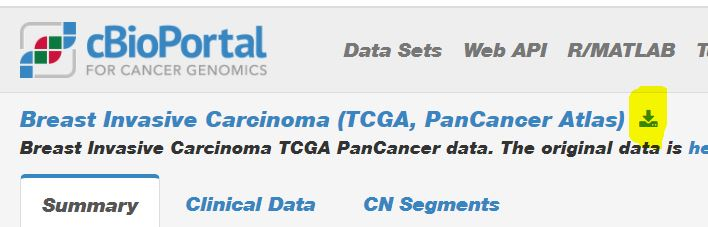

# BMEG 310 Project Overview

## General

The purpose of the project is to give students the opportunity to apply their understanding of course fundamentals to real data. Students will be organised into teams and given a TCGA cancer dataset to analyze, with the goal that they will capture biologically relevant trends characteristic of the cancer in question. 

## Project kick-off date
**October 31** 

## Project timelines
Please check Canvas for deadlines. 

## Teams and project topics

Students have been organised into teams of 3 (rarely, 2 or 4) to complete the project.  

- Groups 1-6:
  - [Breast Invasive Carcinoma (TCGA, PanCancer Atlas)](https://www.cbioportal.org/study?id=brca_tcga_pan_can_atlas_2018)
- Groups 8-12:
  - [Bladder Urothelial Carcinoma (TCGA, PanCancer Atlas)](https://www.cbioportal.org/study?id=blca_tcga_pan_can_atlas_2018)
- Groups 13-18:
  - [Liver Hepatocellular Carcinoma (TCGA, PanCancer Atlas)](https://www.cbioportal.org/study?id=lihc_tcga_pan_can_atlas_2018)
- Groups 19-23:
  - [Lung Squamous Cell Carcinoma (TCGA, PanCancer Atlas)](https://www.cbioportal.org/study?id=lusc_tcga_pan_can_atlas_2018)
- Groups 24-28:
  - [Kidney Renal Clear Cell Carcinoma (TCGA, PanCancer Atlas)](https://www.cbioportal.org/study?id=kirc_tcga_pan_can_atlas_2018)
- Groups 29-35:
  - [Prostate Adenocarcinoma (TCGA, PanCancer Atlas)](https://www.cbioportal.org/study?id=prad_tcga_pan_can_atlas_2018)

## Process

In this project you will perform analysis on a TCGA Cancer dataset similarly to https://pubmed.ncbi.nlm.nih.gov/28988769/. In other words, we would like teams to use methods they have learned in the lectures, tutorials and assignments, such as clustering, regression, classification, differential expression, survival analysis, and visualization methods (among other approaches) to show that some trend of the Cancer type in question may be explained by characteristics of certain genes, and the potential mechanisms implicated. 
The teaching team will provide a roadmap for the project analysis that will be considered as the minimum amount of work that needs to be carried out during the project.
Groups will be free to choose from different approaches and algorithms to perform their analysis and may investigate any trends they find in the data. Groups will also be expected to interpret the results of their data and propose biological explanations for the trends they see. This will be an important part of the project and the expectation is that each team will derive different conclusions from the data that they have analyzed.

Dos: 
 *  Do: look at other papers for examples of what kinds of things you could try (e.g. below)
 *  Don't: try to recapitulate the analysis from a published paper. This project is about data exploration, not about recreating the "correct" answer.

### Examples:

Here are a couple examples of papers that explore similar datasets. 
 * https://www.cell.com/cell/fulltext/S0092-8674(17)31056-5
 * https://www.nature.com/articles/ng.3849

### Data

You will be using datasets from The Cancer Genome Atlas (TCGA) containing variant calls, expression levels, and comprehensive individual data for many patients who underwent treatment for the same cancer type. Each team will be randomly assigned a dataset for analysis. 

You will only need to use the mutation, expression and clinical data. No other datasets (e.g., methylation, miRNA, etc.) are expected to be used.

Within each dataset are 3 files of importance:

**data_clinical_patient.txt** : contains a list of patients with data on each individual such as Age, Sex, Race, and Survival

**data_mutations_extended.txt** : contains a list of mutations and a list of patients in which they are found for each

**RNA-Seq count matrix** : contains a set of expression levels for all genes for each patient (Dataset can be downloaded following this instruction [here](https://htmlpreview.github.io/?https://AIMLab-UBC/BMEG310_2022/main/FinalProject/FinalProjectOvervew.md/AIMLab-UBC/BMEG310_2022/edit/main/FinalProject/Instruction_TCGA_RNAseq.html)

Get the <u>first two datasets</u> from the link associated with the project name. You will be redirected to a page where you can download all the data as shown here in the upper left corner. First download all the data related to your project as a zip file, then select these two **.txt** files

These files will be used for the bulk of the analysis. All major data preprocessing steps, including dataset normalization, have already been performed for the variant and expression level files, so the remaining analysis steps may all be completed using only R. Given the information available in the patient file, the major areas of investigation will be to tie patient traits to expression levels and mutations of certain genes. One of the major patient traits to explore is the overall survival, which permits survival analysis, although groups are welcome to explore other patient traits if they wish. 

### Research Process

The research process is the list of steps that are taken to extract relevant information from the data and assess it to look for trends. Groups should take a look at their data, follow the provided roadmap and come up with an outline of the steps they plan to take during analysis and the type of results to be expected. This notably should include any preferred classification/clustering/regression algorithms, which patient variables will be used, and how expression and variant data will each be used. This should be organised as a list of steps, ie. a pipeline or workflow, to show how information will be processed each step of the way from the base data to the final result. It is also recommended to develop a timeline for completing each step in the workflow. Instructors and TAs will be able to give feedback to make sure the approach is feasible and offer suggestions for improvement.

As teams explore the data, they will need to look for trends related to the activity/mutation of certain genes and the many patient factors which are available. This search will likely take some trial and error as different data factors are investigated and considered (it may be sped up with procedures such as multiple hypothesis testing), but teams should try to formulate a research question detailing how they will design their pipeline to expressly look for these trends. Students may look at other investigations such as the TCGA paper linked to above (in Process section) for inspiration. Again, instructors and TAs will review proposals and provide feedback to ensure students are on the right track.

## Deliverables

**Part 1:** Progress DE Analysis Report
* Purpose: finish differential expression analysis part of the project and get feedback from the teaching team. This will be a good opportunity to adjust course and get early feedback before putting together the final report. This report will not be marked but the TAs will provide feedback on the analysis. That said, if a team does not submit this portion, the mark allocated to DE analysis portion of the project will be forfeited. 
* This report should be organised and contain the following sections:
    * **Introduction/Abstract:** Should summarize the contents of the report, including an overview of the approach, dataset used, and expected results
    * **Analysis Workflow:** Give a detailed description of your analysis workflow including the algorithms (approaches) you have tried and the patient variables you have investigated.
    * **Results:** Should provide a clear summary of the result you have obtained through analysis, as well as the research question on which you are operating. This may be very specific or general, depending on the angle of your investigation, but should convey the importance of your work.
    * **Challenges:** Use this section to address any difficulties you are encountering, or expect you will encounter as you make progress with the project. This may include limitations of a current approach or a lack of meaningful results. Please explain why you believe this problem is occurring, and highlight any limitations in your data you have found. 
    * **Duties and contributions:** For each group member, provide a list of work done and tasks to which they have contributed, as well as a list of tasks to which they are assigned moving forward. Note, writing reports/preparing the presentation are also project tasks and should be listed.
* The report should not be longer than 2 pages in 11 point font Times New Roman.
* This report along with the Rmarkdown document for analysis (all merged in one pdf file) should be uploaded to Canvas.

**Part 2:** Oral Presentations
* A presentation (up to 8 minutes) of your project, to be pre-recorded and uploaded to Youtube, which should include the following sections:
    * **Project Goal:** An introduction to your dataset, the disease you are investigating, and an explanation of your research question and process. Should provide a clear summary of the result you have attempted to show with your analysis, and should convey the biological and clinical importance of the analysis you have decided to perform.
    * **Methods:** Give a detailed walkthrough of the workflow you have developed. Provide a reason why each component was chosen, and explain how the workflow is suited to the research question you have defined.
    * **Discussion:** Provide a detailed overview of your results through each stage of your analysis. Clearly highlight any information relevant to the overall result you have found, including any challenges you faced with your dataset or workflow. Show how this information has led you to a conclusion regarding the results of your investigations and how this conclusion addresses your research question. If no conclusive result was found, explain why you believe this is the case, citing trends in your data. If you have found important trends in your data related to the genome, propose a biological interpretation of these trends in terms of possible mechanisms. Try to link any biological effects to potential clinical relevance. Finally, it is important to perform a literature search to see if the findings/interpretation/hypotheses identified from your exploratory analysis work are supported by the literature. You should put your results in the context of existing knowledge wherever appropriate.
* The presentation videos should be only available through the provided link (i.e., they should not be shared with public). In Youtube, this can be done by making your video **Unlisted**: please see the following link: https://support.google.com/youtube/answer/157177?co=GENIE.Platform%3DDesktop&hl=en  
* Presentation time should be divided approximately equally among team members so that everyone gets to contribute.
* Marks will be awarded for organization of presentation (20%), clarity of visual aspect of presentation (20%), clarity and completeness of project goals, methods, and results (ie. the goal and methods are logical and the results are well explained in the context of the research question) (40%), and 20% for clarity of speaker's explanations and discussion (awarded per individual speaker).
* Marks will not be deducted for inconclusive results. However, it is expected that some result (promising or not) will be obtained, and the presentation should try to explain the context of these results and speak to their origin.
* Your presentations will be peer reviewed by 4 other teams, and your final mark for the presentation will be the aggregate of the peer evaluation (30%) and the teaching team (70%)

**Part 3: The Final Report**

The Final Project Report is comprised of three sections, the codebase (Rmarkdown), together with the written Report, and the peer evaluation (mandatory, but ungraded).

1. **Final Report** 
 * This report should contain the following sections:
    * **Abstract:** Give an overview summarizing the contents of your report with focus on purpose, results, and relevancy of your work.
    * **Introduction:** Explain the background of your investigation, including relevant information regarding the cancer in question. Outline the goal of the project including the research question, and explain the importance of your investigation in relation to possible biological and clinical applications.
    * **Methods:** Give a detailed explanation of your workflow including the algorithms you have used and the structure of the data with which you are working. Provide reasoning for every choice you have made in the design of your workflow, placing it in the context of the data. Explain how the workflow is suited to the research question you have defined.
    * **Results:** Citing relevant figures and tables, summarize the results of your investigation. Use methods of presenting data such as those which have been covered in assignments and tutorials to convey your results concisely and frame any important trends that have been discovered, or use them to highlight a lack of important trends if this was the case.
    * **Discussion:** Highlight important trends in your data and explain them both in the context of the data and in the context of biological/environmental factors of the disease where possible. Discuss any challenges that were faced with the dataset and workflow, and explain how they were addressed. Present a conclusion based on the results of the investigation and explain how this addresses the research question.
    * **Contributions:** Detail the contributions of each group member and the proportions they contributed. For instance: "AB and CD planned the analysis, contributing equally. AB performed the analysis of mutation data. CD analyzed the gene expression data. AB and CD contributed equally to the progress report, final report, and presentation." This should be done by group consensus. If there is a dispute over who did what and in what proportion, break it down until it is clear who did what (e.g. "AB wrangled the gene expression data into a usable form, CD performed the differential expression analysis and functional enrichment, and AB investigated the biological meaning of the enriched terms."). If there is a dispute that can't be resolved with further subdivision, this can also be described: (e.g. "AB and CD both wrote the report, and both feel that they contributed 70% of the writing"). 
 * The report should not be longer than 8 pages in 11 point font Times New Roman (single space, 0.75" margin on all sides), including tables and figures.   
 * Cite references where relevant. Use IEEE style and include a bibliography at the end of the report. Often a reference or two can help explain the disease or give credence to a trend you see in the data. References do not count towards the page limit.
 * Marks will be awarded for formatting and organization of the report (10%), clarity of introduction (20%), thoroughness of methods (10%), quality and relevance of tables and figures (20%), clarity of written summary of results (10%), and clarity and completeness of discussion and contributions (30%). 
 * **HOW TO SUBMIT PROJECT:** There will be a Canvas Assignmnet for submitting the project report and codebase (Rmarkdown). 

2. **Codebase**
    * You should use R markdown for all your analysis, and knit it to PDF and merged with your Final Report (details below).
    * All code should be well-organised and easy to read. Please include comments on major sections or complicated code pieces to explain the function of the code. Reference the types of analyses being done (and refer to various parts of the Project Report containing the results/figures) so that we can tell where different parts of your report originated from.  

3. **Peer Feedback Survey**
    * At the end of project submission, students will be required to submit a confidential peer feedback survey, similarly to the assignments. 
    * 35% of your project grade (15.75% of your final mark) will be derived from these surveys. However, the teaching team reserves the right to adjust individual student's project grades if specific group members have contributed little to the project or deliverables.

**Part 4:** Peer grading of submitted presentations
* We will assign each team 4 projects and they will need to watch the submitted videos and mark them according to the criteria for oral presentations. 
* In addition to the peer evaluation, at least two of the teaching team (instructors & TAs) will grade the project. 
* Final grade for the presentation will be the aggregate of the peer evaluation (30%) and teaching team (70%). 
