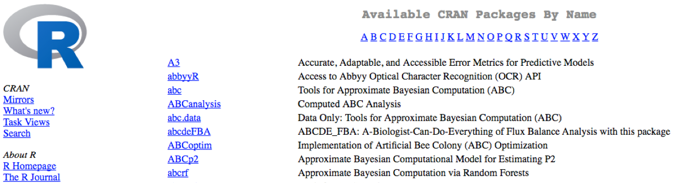

## Learning Objectives

* Describe what R and RStudio are.
* Interact with R using RStudio.
* Get familiar with CRAN or Bioconductor repositories
* Install and load libraries
* Getting help in R


## What are R and RStudio?

The common misconception is that R is a programming language but in fact it is much more than that. Think of R as an environment for statistical computing and graphics, which brings together a number of features to provide powerful functionality.

RStudio is freely available open-source Integrated Development Environment (IDE).


## Creating a new project directory in RStudio

Let's create a new project directory for our "Introduction to R" lesson today. 

1. Open RStudio
2. Go to the `File` menu and select `New Project`.
3. In the `New Project` window, choose `New Directory`. Then, choose `New Project`. Name your new directory `Intro-to-R` and then "Create the project as subdirectory of:" the Desktop (or location of your choice).
4. Click on `Create Project`.
5. After your project is completed, if the project does not automatically open in RStudio, then go to the `File` menu, select `Open Project`, and choose `Intro-to-R.Rproj`.
6. When RStudio opens, you will see three panels in the window.
7. Go to the `File` menu and select `New File`, and select `R Script`. The RStudio interface should now look like the screenshot below.


## RStudio Interface

**The RStudio interface has four main panels:**

1. **Console**: where you can type commands and see output. *The console is all you would see if you ran R in the command line without RStudio.*
2. **Script editor**: where you can type out commands and save to file. You can also submit the commands to run in the console.
3. **Environment/History**: environment shows all active objects and history keeps track of all commands run in console
4. **Files/Plots/Packages/Help**

## Organizing your working directory & setting up

### Viewing your working directory

Before we organize our working directory, let's check to see where our current working directory is located by typing into the console:

```{r}
getwd()
```

Your working directory should be the `Intro-to-R` folder constructed when you created the project. The working directory is where RStudio will automatically look for any files you bring in and where it will automatically save any files you create, unless otherwise specified. 


If you wanted to choose a different directory to be your working directory, you could navigate to a different folder in the `Files` tab, then, click on the `More` dropdown menu and select `Set As Working Directory`.
 


## Packages and Libraries

**Packages** are collections of R functions, data, and compiled code in a well-defined format, created to add specific functionality. There are 10,000+ user contributed packages and growing.

There are a set of **standard (or base) packages** which are considered part of the R source code and automatically available as part of your R installation. Base packages contain the **basic functions** that allow R to work, and enable standard statistical and graphical functions on datasets; for example, all of the functions that we have been using so far in our examples. 

The directories in R where the packages are stored are called the **libraries**. The terms *package* and *library* are sometimes used synonymously and there has been [discussion](http://www.r-bloggers.com/packages-v-libraries-in-r/) amongst the community to resolve this. It is somewhat counter-intuitive to _load a package_ using the `library()` function and so you can see how confusion can arise.


You can check what libraries are loaded in your current R session by typing into the console:

```{r}
sessionInfo() #Print version information about R, the OS and attached or loaded packages

# OR

search() #Gives a list of attached packages
```

In this workshop we have introduced you to functions from the standard base packages. However, the more you work with R you will come to realize that there is a cornucopia of R packages that offer a wide variety of functionality. To use additional packages will require installation. Many packages can be installed from the [CRAN](http://cran.r-project.org/) or [Bioconductor](https://www.bioconductor.org/) repositories.

### Package installation from CRAN 

CRAN is a repository where the latest downloads of R (and legacy versions) are found in addition to source code for thousands of different user contributed R packages.



Packages for R can be installed from the [CRAN](http://cran.r-project.org/) package repository using the `install.packages` function. This function will download the source code from on the CRAN mirrors and install the package (and any dependencies) locally on your computer. 

An example is given below for the `ggplot2` package that will be required for some plots we will create later on. Run this code to install `ggplot2`.

```{r, eval=F, echo=T}
install.packages("ggplot2")
```

### Package installation from Bioconductor
Alternatively, packages can also be installed from [Bioconductor](https://www.bioconductor.org/), another repository of packages which provides tools for the analysis and comprehension of high-throughput **genomic data**. These packages includes (but is not limited to) tools for performing statistical analysis, annotation packages, and accessing public datasets.


There are many packages that are available in CRAN and Bioconductor, but there are also packages that are specific to one repository. Generally, you can find out this information with a Google search or by trial and error. 

To install from Bioconductor, you will first need to install BiocManager. *This only needs to be done once ever for your R installation.* 

```{r, eval=F, echo=T}
install.packages("BiocManager")
```

Now you can use the `install()` function from the `BiocManager` package to install a package by providing the name in quotations. 

Here we have the code to install `ggplot2`, through Bioconductor:

```{r, eval=F, echo=T}

BiocManager::install("ggplot2")
```

> The code above may not be familiar to you - it is essentially using a new operator, a double colon `::` to execute a function from a particular package. This is the syntax: `package::function_name()`. 

### Loading libraries
Once you have the package installed, you can **load the library** into your R session for use. Any of the functions that are specific to that package will be available for you to use by simply calling the function as you would for any of the base functions. *Note that quotations are not required here.*


```{r}
library(ggplot2)
```

You can also check what is loaded in your current environment by using `sessionInfo()` or `search()`

We only need to install a package once on our computer. However, to use the package, we need to load the library every time we start a new R/RStudio environment. You can think of this as **installing a bulb** versus **turning on the light**. 


*Analogy and image credit to [Dianne Cook](https://twitter.com/visnut/status/1248087845589274624) of [Monash University](https://www.monash.edu/).* 


## How to quit?
```{r,eval=F, echo=T}
q()
#to quit an R session
```


## Getting help
```{r}
help.start()
```
```{r}
help(sum)  # Access help file for function sum
```
```{r}
?sum # Searches the help files for function sum
```

```{r}
help.search("sum") #uses the argument character to search help files
```


```{r, eval=F, echo=T}
help(package="package_name") # All the help files related to the package can be checked 
```

## Assignment operator

To do useful and interesting things in R, we need to assign _values_ to
_variables_ using the assignment operator, `<-`.  For example, we can use the assignment operator to assign the value of `3` to `x` by executing:

```{r}
x <- 3
```

The assignment operator (`<-`) assigns **values on the right** to **variables on the left**. 

*In RStudio, typing `Alt + -` (push `Alt` at the same time as the `-` key, on Mac type `option + -`) will write ` <- ` in a single keystroke.*


## Variables

Let's create another variable called `y` and give it a value of 5. 

```{r}
y <- 5
```

When assigning a value to an variable, R does not print anything to the console. You can force to print the value by using parentheses or by typing the variable name.

```
y
```

You can also view information on the variable by looking in your `Environment` window in the upper right-hand corner of the RStudio interface.


Now we can reference these buckets by name to perform mathematical operations on the values contained within. What do you get in the console for the following operation: 

```{r}
x + y
```

Try assigning the results of this operation to another variable called `number`. 

```{r}
number <- x + y
number
```


---

*This lesson has been adapted from [Harvard Chan Bioinformatics Core (HBC)](http://bioinformatics.sph.harvard.edu/)*

