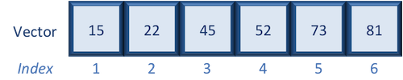

## Learning Objectives

* Construct data structures to store external data in R.
* Inspect data structures in R.
* Demonstrate how to subset data from data structures.
* Brief introduction to 'for loop', and conditional statements
* Write basic functions


### Vectors

#### Selecting using indices

If we want to extract one or several values from a vector, we must provide one or several indices using square brackets `[ ]` syntax. The **index represents the element number within a vector** (or the compartment number, if you think of the bucket analogy). R indices start at 1. Programming languages like Fortran, MATLAB, and R start counting at 1, because that's what human beings typically do. Languages in the C family (including C++, Java, Perl, and Python) count from 0 because that's simpler for computers to do.

Let's start by creating a vector called age:

```{r}
age <- c(15, 22, 45, 52, 73, 81)
```



Suppose we only wanted the fifth value of this vector, we would use the following syntax:

```{r}
age[5]
```

If we wanted all values except the fifth value of this vector, we would use the following:

```{r}
age[-5]
```

If we wanted to select more than one element we would still use the square bracket syntax, but rather than using a single value we would pass in a *vector of several index values*:

```{r}
age[c(3,5,6)]   ## nested

# OR

## create a vector first then select
idx <- c(3,5,6) # create vector of the elements of interest
age[idx]
```

To select a sequence of continuous values from a vector, we would use `:` which is a special function that creates numeric vectors of integer in increasing or decreasing order. Let's select the *first four values* from age:

```{r}
age[1:4]
```

Alternatively, if you wanted the reverse could try `4:1` for instance, and see what is returned. 


#### Selecting using indices with logical operators

We can also use indices with logical operators. Logical operators include greater than (>), less than (<), and equal to (==). A full list of logical operators in R is displayed below:

| Operator | Description |
| :-----------:|:----------------|
| > | greater than |
| >= | greater than or equal to|
| < | less than |
| <= | less than or equal to |
| == | equal to |
| != | not equal to |
| & | and |
| \| |or |

We can use logical expressions to determine whether a particular condition is true or false. For example, let's use our age vector: 
	
```{r}
age
```

If we wanted to know if each element in our age vector is greater than 50, we could write the following expression:	

```{r}
age > 50
```

Returned is a vector of logical values the same length as age with TRUE and FALSE values indicating whether each element in the vector is greater than 50.

We can use these logical vectors to select only the elements in a vector with TRUE values at the same position or index as in the logical vector.

Select all values in the `age` vector over 50 **or** `age` less than 18:

```{r}
age > 50 | age < 18

age

age[age > 50 | age < 18]  ## nested

# OR

## create a vector first then select
idx <- age > 50 | age < 18
idx
age[idx]
```

##### Indexing with logical operators using the `which()` function

While logical expressions will return a vector of TRUE and FALSE  values of the same length, we could use the `which()` function to output the indices where the values are TRUE. Indexing with either method generates the same results, and personal preference determines which method you choose to use. For example:

```{r}
which(age > 50 | age < 18)

age[which(age > 50 | age < 18)]  ## nested

# OR

## create a vector first then select
idx_num <- which(age > 50 | age < 18)
age[idx_num]
```

Notice that we get the same results regardless of whether or not we use the `which()`. Also note that while `which()` works the same as the logical expressions for indexing, it can be used for multiple other operations, where it is not interchangeable with logical expressions.

### Dataframes

Dataframes (and matrices) have 2 dimensions (rows and columns), so if we want to select some specific data from it we need to specify the "coordinates" we want from it. We use the same square bracket notation but rather than providing a single index, there are *two indices required*. Within the square bracket, **row numbers come first followed by column numbers (and the two are separated by a comma)**. 

## Reading data into R
If we have text file separated by commas (comma-separated values), we could use the function `read.csv`. However, if the data are separated by a different delimiter in a text file, we could use the generic `read.table` function and specify the delimiter as an argument in the function.

```{r}
metadata <- read.csv(file="data/mouse_exp_design.csv")
```

## Inspecting data structures

Let's use the `metadata` file that we created to test out data inspection functions. 

Take a look at the dataframe by typing out the variable name `metadata` and pressing return; the variable contains information describing the samples in our study. Each row holds information for a single sample, and the columns contain categorical information about the sample `genotype`(WT or KO),  `celltype` (typeA or typeB), and `replicate number` (1,2, or 3).


```{r}
metadata

```

Suppose we had a larger file, we might not want to display all the contents in the console. Instead we could check the top (the first 6 lines) of this `data.frame` using the function `head()`:

```{r}
head(metadata)
```


### List of functions for data inspection

Here is a non-exhaustive list of
functions to get a sense of the content/structure of data.

* All data structures - content display:
	- **`str()`:** compact display of data contents (env.)
	- **`class()`:** data type (e.g. character, numeric, etc.) of vectors and data structure of dataframes, matrices, and lists.
	- **`summary()`:** detailed display, including descriptive statistics, frequencies
	- **`head()`:** will print the beginning entries for the variable
	- **`tail()`:** will print the end entries for the variable
* Vector and factor variables: 
	- **`length()`:** returns the number of elements in the vector or factor
* Dataframe and matrix variables:
	- **`dim()`:** returns dimensions of the dataset
	- **`nrow()`:** returns the number of rows in the dataset
	- **`ncol()`:** returns the number of columns in the dataset
	- **`rownames()`:** returns the row names in the dataset  
	- **`colnames()`:** returns the column names in the dataset

## Selecting data using indices and sequences

When analyzing data, we often want to **partition the data so that we are only working with selected columns or rows.** A data frame or data matrix is simply a collection of vectors combined together. So let's begin with vectors and how to access different elements, and then extend those concepts to dataframes.


```{r}
metadata[1, 1]   # element from the first row in the first column of the data frame
metadata[1, 3]   # element from the first row in the 3rd column
```

Now if you only wanted to select based on rows, you would provide the index for the rows and leave the columns index blank. The key here is to include the comma, to let R know that you are accessing a 2-dimensional data structure:

```{r}
metadata[3, ]    # vector containing all elements in the 3rd row
```

If you were selecting specific columns from the data frame - the rows are left blank:

```{r}
metadata[ , 3]    # vector containing all elements in the 3rd column
```

Just like with vectors, you can select multiple rows and columns at a time. Within the square brackets, you need to provide a vector of the desired values:	

```{r}
metadata[ , 1:2] # dataframe containing first two columns
```

```{r}
metadata[c(1,3,6), ] # dataframe containing first, third and sixth rows
```

For larger datasets, it can be tricky to remember the column number that corresponds to a particular variable. (Is celltype in column 1
or 2? oh, right... they are in column 1). In some cases, the column number for a variable can change if the script you are using adds or removes columns. It's therefore often better to use column names to refer to a particular variable, and it makes your code easier to read and your intentions clearer.

```{r}
metadata[1:3 , "celltype"] # elements of the celltype column corresponding to the first three samples
```


You can do operations on a particular column, by selecting it using the `$` sign. In this case, the entire column is a vector. For instance, to extract all the genotypes from our dataset, we can use: 

```{r}
metadata$genotype 
```
You can use `colnames(metadata)` or `names(metadata)` to remind yourself of the column names. We can then supply index values to select specific values from that vector. For example, if we wanted the genotype information for the first five samples in `metadata`:

```{r}
colnames(metadata)

metadata$genotype[1:5]
```

The `$` allows you to select a single column by name. To select multiple columns by name, you need to  concatenate a vector of strings that correspond to column names: 

```{r}
metadata[, c("genotype", "celltype")]
```

While there is no equivalent `$` syntax to select a row by name, you can select specific rows using the row names. To remember the names of the rows, you can use the `rownames()` function:

```{r}
rownames(metadata)
```
```{r}
metadata[c("sample10", "sample12"),]
```

#### Selecting using indices with logical operators

With dataframes, similar to vectors, we can use logical vectors for specific columns in the dataframe to select only the rows in a dataframe with TRUE values at the same position or index as in the logical vector. We can then use the logical vector to return all of the rows in a dataframe where those values are TRUE.

```{r}
idx <- metadata$celltype == "typeA"
idx
```
```{r}
metadata[idx, ]
```

##### Selecting indices with logical operators using the `which()` function
As you might have guessed, we can also use the `which()` function to return the indices for which the logical expression is TRUE. For example, we can find the indices where the `celltype` is `typeA` within the `metadata` dataframe:

```{r}
idx <- which(metadata$celltype == "typeA")
idx
```
```{r}
metadata[idx, ]
```

Or we could find the indices for the metadata replicates 2 and 3:

```{r}
idx <- which(metadata$replicate > 1)
	
metadata[idx, ]
```

Let's save this output to a variable:

```{r}
sub_meta <- metadata[idx, ]
sub_meta
```

### Writing to file 

Everything we have done so far has only modified the data in R; the files have remained unchanged. Whenever we want to save our datasets to file, we need to use a `write` function in R. 

To write our matrix to file in comma separated format (.csv), we can use the `write.csv` function. There are two required arguments: the variable name of the data structure you are exporting, and the path and filename that you are exporting to. By default the delimiter is set, and columns will be separated by a comma:

```{r}
write.csv(sub_meta, file="data/subset_meta.csv")
```

Similar to reading in data, there are a wide variety of functions available allowing you to export data in specific formats. 


> ### Tidyverse package for data wrangling
>
> The methods presented above are using base R functions for data wrangling.  But one of the best packages is **Tidyverse suite of packages**, specifically designed to make data wrangling easier.


## for loop
for loops iterate over elements of a looping vector.

```{r, eval=F, echo=T}
for(variable in sequence) { 
  statements 
}
```

```{r}
for (i in 1:10) { 
  print (i*i) 
}
```
```{r}
avector <- c(2, 9, 100, 133)
for (i in avector) { 
  print (i*i) 
}

```
```{r}
for (i in seq(1, 10, by = 2)) { 
  print (i*i) 
}

```
Now, let's load iris dataset
```{r}
mydf <- iris
mydf
```

for example we can get the average of columns 1 to 3
```{r}
myve <- numeric(length(mydf[,1]))
for(i in seq(myve)) {
	myve[i] <- mean(as.numeric(mydf[i,1:3]))
}
myve[1:8]
```
## if statement
The syntax of if statement is:

```{r, eval=F, echo=T}
if (test_expression) {
statement
}
```

## if…else statement
```{r, eval=F, echo=T}
if (test_expression) {
statement1
} else {
statement2
}
```

Example:
```{r}
x <- 5
if (x < 0) {
print("Negative number")
} else if (x > 0) {
print("Positive number")
} else
print("Zero")
```

```{r}
q<-3
t<-5
# if else conditional statement written on one line
if(q<t){
  w <- q+t
} else
w <- q-t
w
```


## What is a function?

Functions are a way to bundle up bits of code to make them easy to reuse. Base R includes numerous built-in functions and there are thousands more R functions in packages available on CRAN and elsewhere.


Here is an example of one of the built-in R functions, `sum()`:

```{r}
x <- c(1, 2, 3, 4, 5) # Create a vector of numbers to sum
sum_x <- sum(x) # Sum the numbers contained in 'x', and save the result as a new variable 'sum_x'
```

You can also write your own functions, called "user-defined functions".

Functions in a package are the same thing as functions you define yourself, they're just stored in a different way.


## How to write a function

The syntax for creating a function is:

```{r}
function_name <- function(arg1, arg2) {
        # function body, e.g. 
        print(paste(arg1, arg2))
}
```

We use `function()` to create a function and assign it to the object `function_name`.

A function is made up of three components:

+ Its **arguments** (in this example, `arg1` and `arg2`) - these are variables used inside the function body which we can set each time we call the function.
   
+ The function **body** (everything between the curly brackets) - this is where we put the code.
   
+ And the function **environment** (where the function was created) - this determines what variables and other functions it has access to. You can find out more about environments [here](https://r4ds.had.co.nz/functions.html#environment).

# Examples of basic functions

## Example 1: a very basic function

Here's an example of a very basic user-defined function, called `add_two()`, that takes `x` as an argument:

```{r}
# This function takes the argument 'x', and adds 2 to it
add_two <- function(x) {
  
  result <- x + 2
  return(result)
  
}
```

The `return()` statement can be used to explicitly state that `result` should be the output of this function. Without a `return()` statement, a function written in R will automatically return the value of the last evaluated expression. So while it's not always essential to use a `return()` statement, it can make the code more clear and is consistent with other programming languages.

---

Let's try using the function `add_two()`:

```{r}
# Calling the function by itself prints the result to the console
add_two(3)

# Alternatively the result can be saved as a new variable
result <- add_two(3) 
```

Note: before you can use a function you need to run the code to create it.

## Example 2: multiple inputs

Functions can accept as many arguments as you like, but can only output one object (if it is necessary to output more than one object, then the desired outputs can be combined together into a list, and the list can be returned). Here's a function that requires two input variables:

```{r}
# This function sums the squares of two numbers
sum_squares <- function(x, y) {
  
  result <- x^2 + y^2
  return(result)
  
}

sum_squares(3, 5)
```

When you call a function, you can specify the arguments by position or name. In this example, the function accepts arguments called `x` and `y`, with the order specified as `x` then `y` in the function definition. Therefore when `sum_squares(3, 5)` is called, the arguments are interpreted as `x = 3` and `y = 5`. Alternatively, if we called `sum_squares(5, 3)` then the arguments would be interpreted as `x = 5` and `y = 3`.

---

For more complicated functions with lots of arguments, specifying the arguments by position becomes more error-prone and harder to understand. Therefore it is often desirable to specify some or all of the arguments by name, then the order of the arguments doesn't matter:

```{r}
sum_squares(x = 3, y = 5)
sum_squares(y = 5, x = 3)
```

---

## Exercise (NOTE: This is an exersize to put what you have learned into action.)

* Hint: The `apply()` family pertains to the R base package and is populated with functions to manipulate slices of data from matrices, arrays, lists and dataframes in a repetitive way. These functions allow crossing the data in a number of ways and ***avoid explicit use of loop constructs***. They act on an input list, matrix or array and apply a named function with one or several optional arguments.

  ```
  vec <- c(1:10)
  apply(vec, 1, sum)
  ```

<u>**Exercise 1)**</u> Write a function that takes a path to a file as string(in this exercise to "GSE71562.csv"). [Row and columns are genes and samples, respectively]


***First***), take the average of the samples for each gene and find the name of the gene with the highest value

***Second***) print the number and names of genes whose average value is 2 standard deviations above the average of the averages


---
>
*This lesson has been adapted from [Harvard Chan Bioinformatics Core (HBC)](http://bioinformatics.sph.harvard.edu/). 
*authors: Meeta Mistry, Mary Piper, Radhika Khetani*
>
